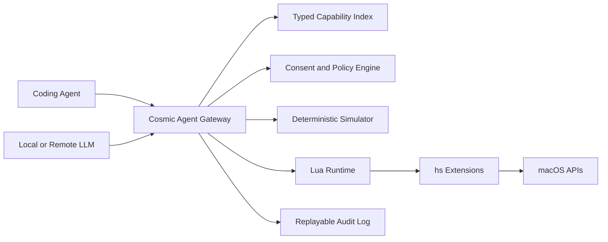

# Agent-Native Cosmic Hammer Roadmap

## Thesis

Cosmic Hammer should become the local macOS agent runtime: agents discover capabilities, request permissioned actions, dry-run them in a simulator, execute through trusted APIs, and leave an auditable trail.

The repo already has the right foundation: [`extensions.manifest`](extensions.manifest), [`LuaRuntime.swift`](Sources/HSSwiftExtensions/LuaRuntime.swift), [`Environment.swift`](Sources/HSDSTCore/Environment.swift), [`hs.swift`](Sources/hs/hs.swift), and [`scripts/docs/README.md`](scripts/docs/README.md).

## Phase 1: Make The Repo Agent-Proof

- Add `just generate`, `just generate-check`, `just test-extension <name>`, `just run-lua <expr>`, `just agent-doctor`, and `just new-extension <name>` in [`justfile`](justfile).
- Generate `build/extension-index.json` from [`extensions.manifest`](extensions.manifest), docs, Swift entry points, Lua files, aliases, tests, and bundle paths.
- Refresh [`CONTRIBUTING.md`](CONTRIBUTING.md) and [`AGENTS.md`](AGENTS.md) so agents get the real 4-column manifest, static-linking model, test-resource flow, and extension checklist.
- Add CI mirroring `zsh -ic 'mise exec -- just verify'`, plus a faster PR gate for generated files, docs lint, and filtered tests.

## Phase 2: Create The Agent Gateway

- Add an `hs.agent` extension that exposes a local JSON-RPC server, then an MCP server, backed by the existing IPC path in [`hs.swift`](Sources/hs/hs.swift).
- Generate typed tool schemas from docs and manifest data instead of asking agents to synthesize Lua strings.
- Add capability scopes such as `window.read`, `window.write`, `clipboard.read`, `clipboard.write`, `shell.run`, `network.access`, `accessibility.control`, and `screen.capture`.
- Require explicit consent policies for dangerous actions, with per-tool allowlists and time-bounded grants.

## Phase 3: Add Simulation, Replay, And Safety

- Extend the existing DST abstraction in [`Environment.swift`](Sources/HSDSTCore/Environment.swift) into a first-class dry-run mode for agent actions.
- Record every action as an event: input state, selected capability, parameters, permission decision, output, side effects, and error.
- Support replaying a workflow against [`Sources/HSDSTSimulator`](Sources/HSDSTSimulator) before it touches the real desktop.
- Add `hs.agent.transaction` for grouped actions with best-effort rollback hooks where APIs allow it.

## Phase 4: Build The Capability Marketplace

- Treat every extension as a package with docs, examples, tests, risk level, permissions, and agent affordances.
- Add `just docs-module <module>` and machine-readable docs output that can power semantic API search, MCP schemas, and UI browsing.
- Create signed automation bundles: Lua workflow, manifest, required permissions, tests, screenshots or fixtures, and compatibility metadata.
- Make Cosmic Hammer capable of installing, testing, and explaining these bundles locally before enabling them.

## Moonshot Features To Prioritize

- **Typed Capability Graph:** A generated map of every `hs.*` module, function, permission, example, test coverage, and implementation file. This unlocks agent self-navigation.
- **MCP/JSON-RPC Gateway:** Lets Cursor, Claude Desktop, local agents, and scripts use Cosmic Hammer as a secure macOS tool server.
- **Deterministic Desktop Simulator:** Agents can test window, pasteboard, file, network, notification, and app workflows without harming the user's machine.
- **Consent And Audit Ledger:** Every agent action is explainable, replayable, revocable, and attributable.
- **Workflow Compiler:** Natural language or structured plans compile into Lua workflows plus tests, instead of one-off fragile scripts.
- **Agent Debugger:** Captures runtime errors, Lua stack traces, generated action logs, screenshots, and suggested fixes in one bundle.

## First Implementation Sequence

1. Implement `extension-index.json` and `just agent-doctor`; this creates the machine-readable substrate and immediately improves agent success.
2. Add `just generate`, `just test-extension`, and `just new-extension`; this removes the highest-friction contribution path.
3. Implement `hs.agent` with local JSON-RPC for a small initial tool set: docs search, module list, evaluate Lua, window read-only state, and dry-run placeholder.
4. Add capability permissions and audit logging before enabling write actions.
5. Layer MCP on top of the same gateway once the JSON-RPC contract is stable.

## Success Criteria

- A coding agent can add a small extension, generate glue, run focused tests, and explain implementation locations from one generated index and documented just commands.
- An AI agent can discover Cosmic Hammer capabilities without reading source, call them through typed schemas, and receive structured errors.
- Risky operations require clear permission grants and produce an audit log.
- New agent features are testable against simulator protocols before being allowed to control the real desktop.
